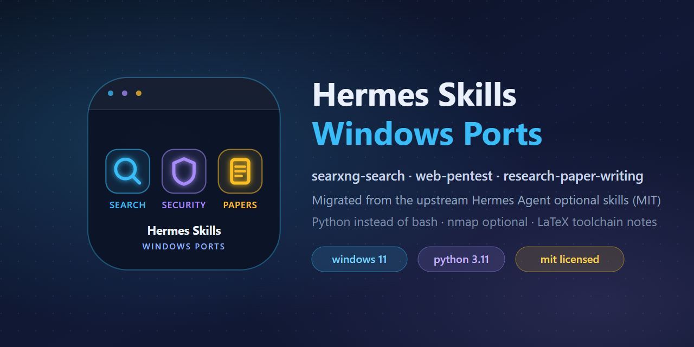

# Hermes Skills — Windows Ports



Windows-ready ports of three [Hermes Agent](https://github.com/NousResearch/hermes-agent)
optional skills that upstream ship as `linux, macos` only, plus the local SearXNG setup
that makes one of them actually usable.

| Skill | Upstream path | What was ported |
|---|---|---|
| [`searxng-search`](skills/searxng-search) | `optional-skills/research/searxng-search` | `searxng.sh` → `scripts/searxng.py` (stdlib only), local-instance-first resolution, honest note about public instances |
| [`web-pentest`](skills/web-pentest) | `optional-skills/security/web-pentest` | `recon-scan.sh` → `scripts/recon_scan.py` (same authorization/scope contract), Python tech fingerprint instead of `whatweb`, Windows-ready Phase 0 |
| [`research-paper-writing`](skills/research-paper-writing) | `optional-skills/research/research-paper-writing` | Windows toolchain notes, `python3` → `python`, `nohup … &` → `Start-Process` |

Plus [`searxng-windows/`](searxng-windows): the one-command-ish way to run a private
SearXNG on Windows (with the JSON API enabled) so `searxng-search` has something to talk to.

## Why this exists

Hermes gates skills by platform. A skill whose frontmatter declares
`platforms: [linux, macos]` is **not loaded on Windows at all**: it never shows up in
`hermes skills list` and `skill_view` answers `not supported on this platform`. These
three were unusable on Windows for three different reasons, and each needed a different fix:

1. **bash wrappers.** `searxng.sh` and `recon-scan.sh` are `#!/bin/bash`. On Windows the
   `bash` that answers is whichever MSYS/WSL install happens to be on `PATH`, and a
   `C:\…` path handed to it can get mangled — the classic `No such file or directory`
   for a file that plainly exists. Both are now Python (`scripts/searxng.py`,
   `scripts/recon_scan.py`) with no third-party dependencies.
2. **Tools that do not exist on Windows.** `whatweb` (used by the original recon script)
   has no Windows build. The ported wrapper produces the technology fingerprint itself
   from response headers plus HTML signatures. `nmap` is supported but optional: without
   it the wrapper falls back to a rate-limited Python TCP scan.
3. **A dead assumption.** `searxng-search` assumed a SearXNG instance answers
   `?format=json`. Public instances no longer do — see below. The port keeps working by
   preferring a local instance.

## Install

Copy the skills into a Hermes profile (default target: the `default` profile):

```powershell
# from this repo
powershell -ExecutionPolicy Bypass -File install.ps1 -Profile research
powershell -ExecutionPolicy Bypass -File install.ps1 -Profile devsecops
```

Skills are loaded per session, so start a new Hermes session afterwards. Verify:

```bash
hermes -p research skills list --enabled-only | grep -E "searxng-search|research-paper-writing"
hermes -p devsecops skills list --enabled-only | grep web-pentest
```

## What was verified

Not "should work" — actually executed on Windows 11 (MiKTeX 25.12, Python 3.11, MSYS git-bash):

- `searxng-search`: `scripts/searxng.py "nextjs cloudflare workers" 3` returned real
  results from a local instance, and a Hermes agent session used the skill end to end
  (loaded it, ran the script, reported the first hit).
- `web-pentest`: `scripts/recon_scan.py` ran a full recon phase against a local service
  with a test engagement — headers, technology fingerprint, `robots.txt` / `sitemap.xml`
  / `.well-known/security.txt` statuses, port scan (3 open) and `evidence/` +
  `request-log.jsonl` written; it refused everything that was not in `scope.txt`.
- `research-paper-writing`: the bundled `iclr2026` and `acl` templates compiled to real
  PDFs with `latexmk -pdf` on MiKTeX.

**Known limits, stated plainly:** the exploitation phases of `web-pentest` were not
exercised (only recon), and `nmap` was not installed in the test environment, so the
fallback Python scan is what ran.

## Public SearXNG instances are effectively closed

`searxng-search` originally relied on a public instance. We probed ~28 of them
(searx.be, search.inetol.net, baresearch.org, searx.tiekoetter.com, priv.au, opnxng.com,
searx.dresden.network, …): every one answers HTTP 200 with an **anti-bot page** —
Cloudflare "Verifying your browser", Anubis proof-of-work, or Substation — instead of
results. `format=json` is disabled on almost all of them, and a headless browser does not
get through either. So the port points at a **self-hosted instance first**; see
[`searxng-windows/`](searxng-windows) for the Windows setup, including the one-line
source patch SearXNG needs to start on Windows at all.

## Credits and licensing

This repository contains **modified copies** of skills from the Hermes Agent repository;
the upstream authors and licenses are preserved in each `SKILL.md` frontmatter:

- `searxng-search` — `hermes-agent` (MIT)
- `web-pentest` — Teknium (teknium1), Hermes Agent (MIT)
- `research-paper-writing` — Orchestra Research (MIT)

The ported scripts here (`scripts/searxng.py`, `scripts/recon_scan.py`) and the
`searxng-windows/` tooling are released under the MIT license — see [LICENSE](LICENSE).

If you would rather have these upstream, the same changes can be offered back to
`NousResearch/hermes-agent` as a PR; the upstream files stay the source of truth.
